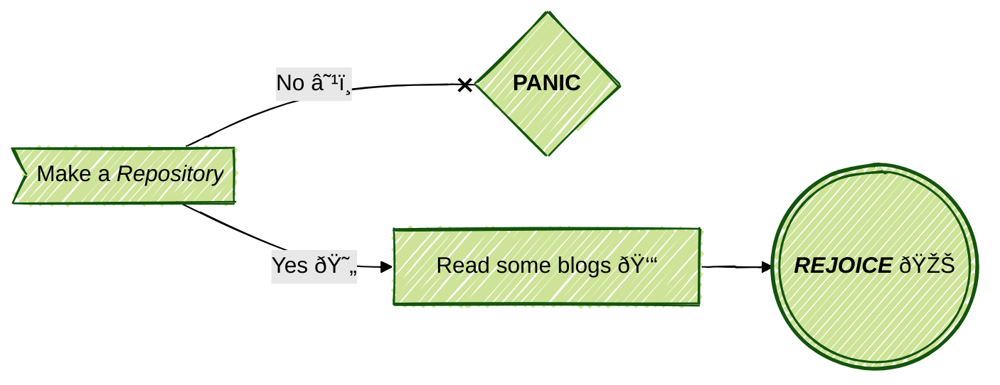

# Alison

This is Alison, testing a repository

 hello
  1. Adding lists
  2. With multiple items
       - and layers?
       - 😺

😄

â­

```mermaid
---
config:
  look: handDrawn
  theme: forest
---
flowchart LR;
    A>"`Make a _Repository_`"]-- No â˜¹ï¸ --xB{"`**PANIC**`"};
    A-- Yes 😄 -->C["`Read  some blogs 👓`"];
    C-->D((("`**_REJOICE_** 🎊`")));
```

